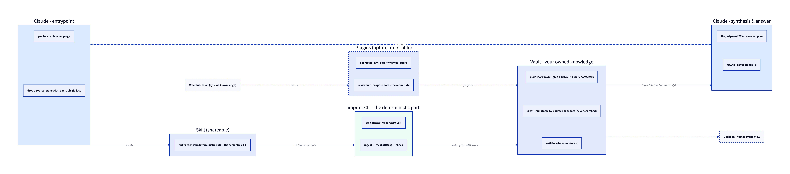

# imprint

A deterministic-first, plain-markdown knowledge vault you own. Deterministic code does the
bulk transform at ~zero token cost; the LLM is spent only on the irreducibly-semantic ~20%
(clean, extract, synthesize). Retrieval is native grep — **no MCP, no vector DB, no embeddings
over the vault.** Open the same folder in Obsidian for a human graph view.

> Sibling to [Whenful](https://whenful.com): Whenful answers *when* do I do my tasks; imprint
> holds *what* I know.

## Architecture



Agents drive a shareable **skill**; the skill splits every job into a **deterministic CLI**
(runs off-context, ~zero tokens) and one **in-session semantic pass** (the LLM via your Claude
subscription/OAuth — never `claude -p`). Everything lands in an **owned markdown vault** you
grep — no MCP on the vault. Whenful (tasks) and Obsidian (human view) are optional.

Source: [`docs/architecture.d2`](docs/architecture.d2) — re-render with `d2 docs/architecture.d2 docs/architecture.svg`.

## Why

A knowledge base for an LLM agent does not need a database the agent queries through a
protocol. It needs a folder of markdown the agent greps directly. Grep over the vault costs
~100 tokens; an MCP/vector layer over the same files costs orders of magnitude more and goes
stale on every edit. So the storage is commodity. The discipline is the product:

- **Deterministic-first.** `ingest` parses a raw transcript into a structured note with no LLM
  call. The LLM only fills the parts that genuinely require judgment.
- **Opt-in, composable.** Tiny core. Every part is a self-contained directory you can
  `rm -rf` with zero cross-dependencies. You add the modules *you* need; nothing is wired in
  by default.
- **Owned.** Plain files on your disk. Can't 404, can't bloat, can't hold your context hostage.

## Install

Requires [Bun](https://bun.sh) ≥ 1.3.

The package distributes via npm. These are aspirational until the first publish lands:

```sh
bunx imprint init      # run without installing
npm i -g imprint       # or install the global CLI
```

Until then, run from a clone:

```sh
git clone https://github.com/aleksandr-bogdanov/imprint.git
cd imprint
bun install            # no runtime deps; this just links the CLI
bun scripts/cli.ts init   # scaffold ./vault and ./raw from templates/
```

The commands below use `imprint` for brevity. From a clone, that's `bun scripts/cli.ts`.

## Setup

```sh
imprint init                         # scaffold vault/ and raw/ from templates/
export IMPRINT_VAULT=~/notes/vault   # optional: point at a vault elsewhere (defaults to ./vault)
imprint plugin add character/scribe.md anti-slop   # enable the default DA + anti-slop rules
```

`imprint plugin add` wires each plugin into `CLAUDE.local.md` (your gitignored, per-machine toggle
file), so the agent loads them every session. See [`plugins/README.md`](plugins/README.md) for the
gallery and the full plugin contract.

**One-time onboarding: create your own `people/<you>.md`.** You appear in nearly every transcript, so
add a self-note first - otherwise every ingest flags you into `needs-review`. It's just a note: ask
the agent to "file a person note for me" once, and entity resolution will link you from then on.

## The loop

```sh
# 1. capture — drop a raw transcript in raw/, then parse it deterministically (no LLM)
imprint ingest raw/2026-06-02-sts2-1on1.txt

# 2. clean — let the agent fill the Summary and extend people/ + projects/ (the only LLM step)

# 3. recall — BM25 ranking over the vault (deterministic, local, no LLM)
imprint recall "STS2 BigQuery"

# 4. plan — feed the retrieved context to the agent to draft an implementation plan
```

A complete worked example lives in [`examples/sts2-demo/`](examples/sts2-demo/): a synthetic
1:1 transcript, the note `ingest` produces from it, the people/project/mistake notes, and
the implementation plan drafted from a `recall`.

## Commands

| Command | What it does | LLM? |
|---------|--------------|------|
| `imprint init` | Scaffold `vault/` + `raw/` from `templates/` | no |
| `imprint ingest <file> [--vault DIR]` | Parse a raw transcript → structured event note; update delta-manifest | no |
| `imprint recall "<query>" [--vault DIR]` | BM25 ranking over title/tags/body (field-boosted, synonym-aware) | no |
| `imprint hot [--vault DIR]` | Print `vault/hot.md` (the session primer) | no |

The vault contract — note formats, conventions, the deterministic-first rule — is in
[`CLAUDE.md`](CLAUDE.md), which an agent auto-loads when working in the vault.

## License

MIT © 2026 Aleksandr Bogdanov
